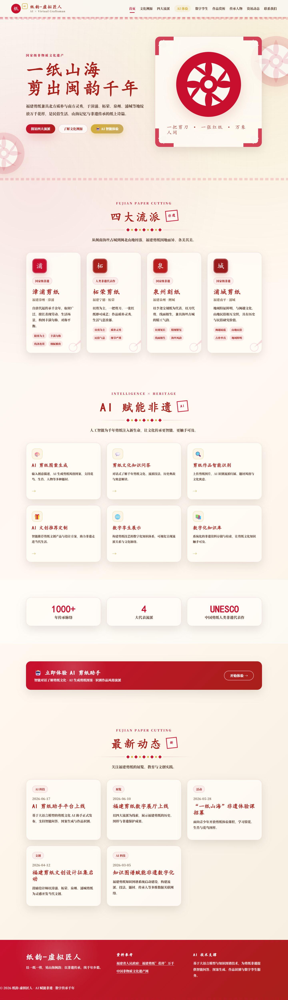
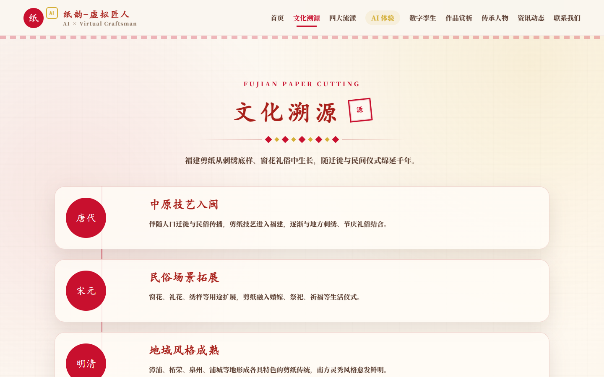
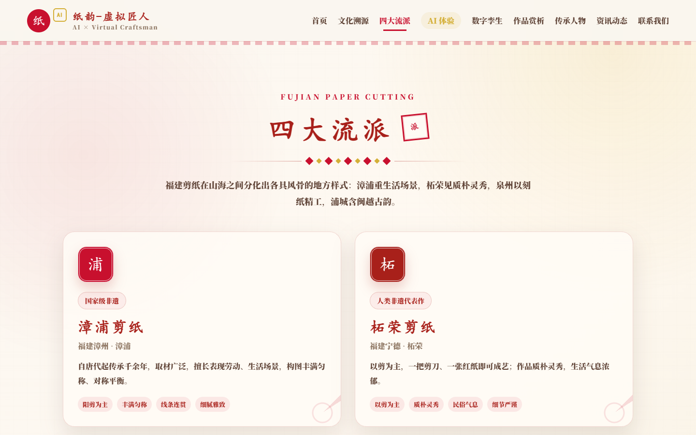
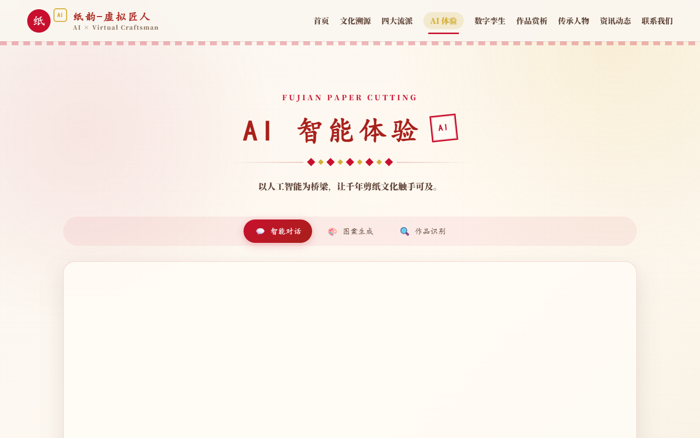
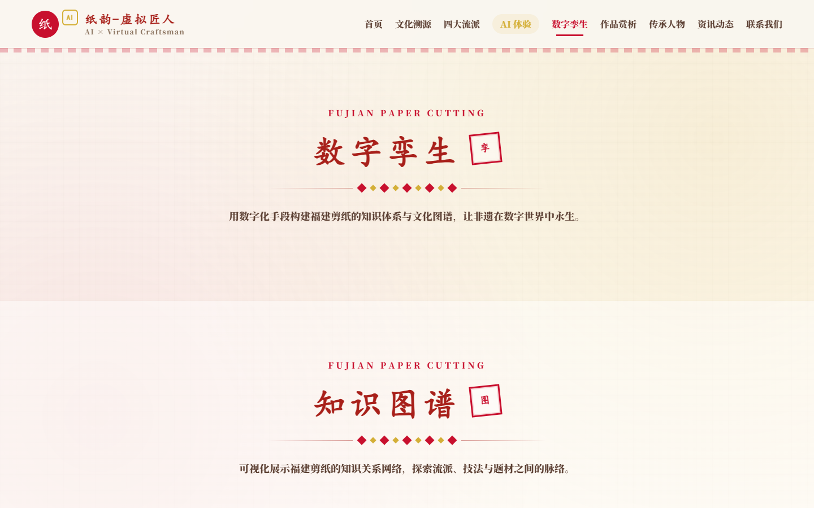
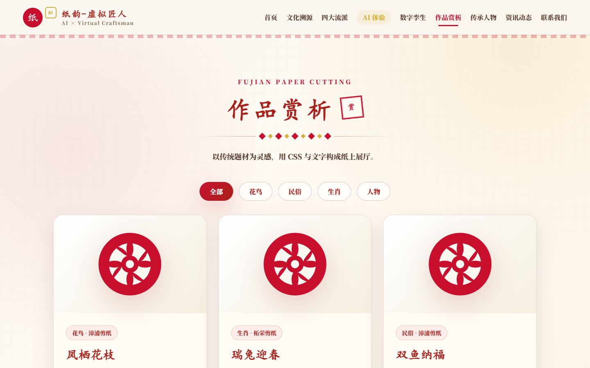
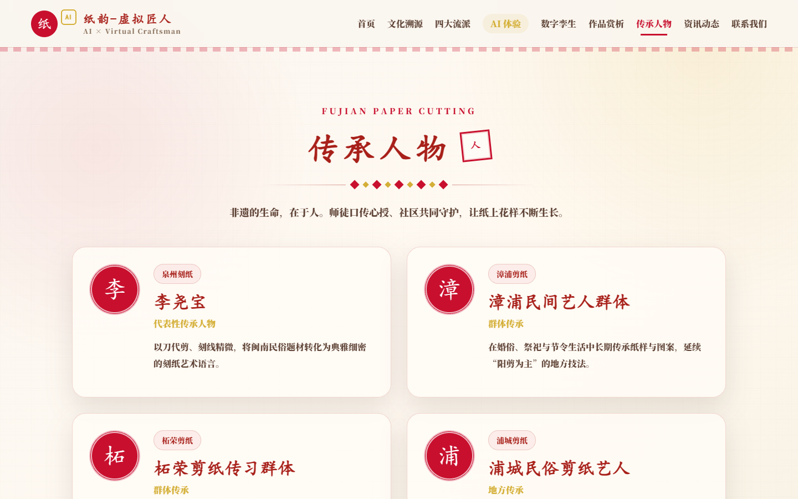
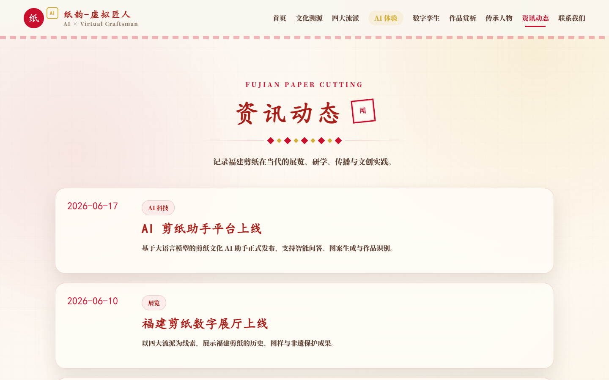
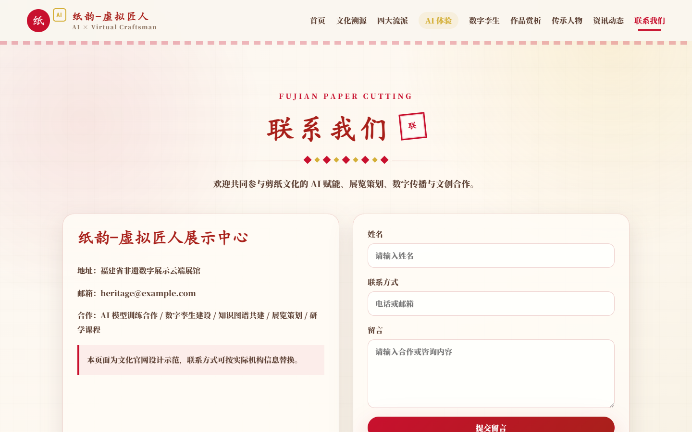

# 福建剪纸文化官网｜AI × Paper Cutting Heritage

一个以 **福建剪纸非遗文化** 为主题的 Vue 3 官网展示项目，围绕漳浦剪纸、柘荣剪纸、泉州刻纸、浦城剪纸等福建代表性剪纸流派，展示文化溯源、流派介绍、作品赏析、传承人物、资讯动态，并加入 AI 智能体验与数字孪生展示模块。

## 项目简介

本项目旨在通过现代前端交互与视觉设计，呈现福建剪纸的历史脉络、艺术特色和当代数字化传承方式。页面采用红纸、印章、剪纸纹样、宣纸肌理等视觉元素，营造传统非遗文化氛围。

项目中的 AI 体验功能目前为前端 Mock 演示，包括：

- 智能问答：模拟福建剪纸文化问答助手
- 图案生成：根据输入文案生成剪纸风格结果描述
- 作品识别：模拟识别剪纸流派、题材、风格与寓意
- 数字孪生：展示知识图谱、数字化档案与技术架构

## 技术栈

- Vue 3
- Vite
- Vue Router
- CSS3 动画与响应式布局

## 功能模块

- 首页：项目主视觉、四大流派入口、AI 赋能展示、最新动态
- 文化溯源：福建剪纸发展时间线与地域文化特征
- 四大流派：漳浦剪纸、柘荣剪纸、泉州刻纸、浦城剪纸
- AI 体验：智能对话、AI 图案生成、作品识别
- 数字孪生：知识图谱、数字化档案、技术架构
- 作品赏析：剪纸题材作品展示
- 传承人物：非遗代表人物介绍
- 资讯动态：展览、教育与文创实践资讯
- 联系我们：合作与留言示例页面

## 项目截图

### 首页


### 首页完整截图



### 文化溯源



### 四大流派



### AI 智能体验



### 数字孪生



### 作品赏析



### 传承人物



### 资讯动态



### 联系我们



## 本地运行

```bash
npm install
npm run dev
```

启动后访问：

```text
http://localhost:5173
```

## 构建项目

```bash
npm run build
```

## 预览构建结果

```bash
npm run preview
```

## 说明

当前版本为前端展示与交互演示版本，AI 功能采用本地 Mock 数据模拟。真实部署时可接入大语言模型 API、图像识别服务、知识图谱后端和数字资产管理系统。
